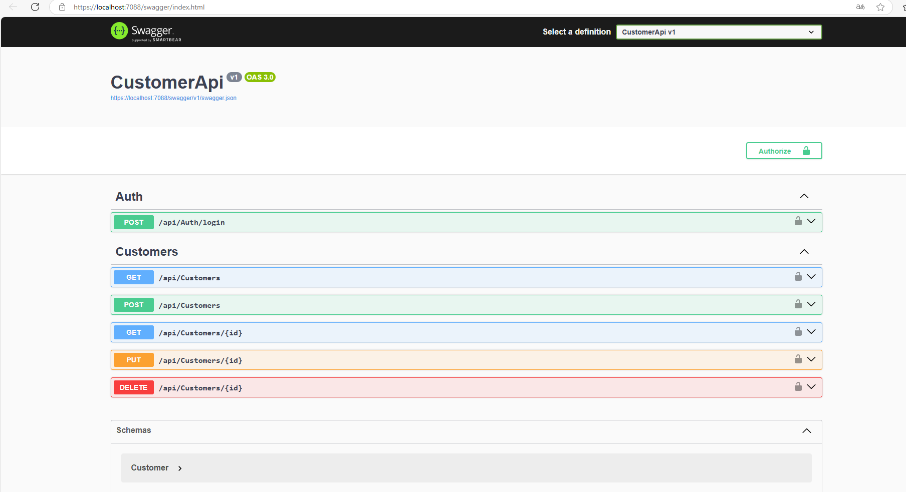
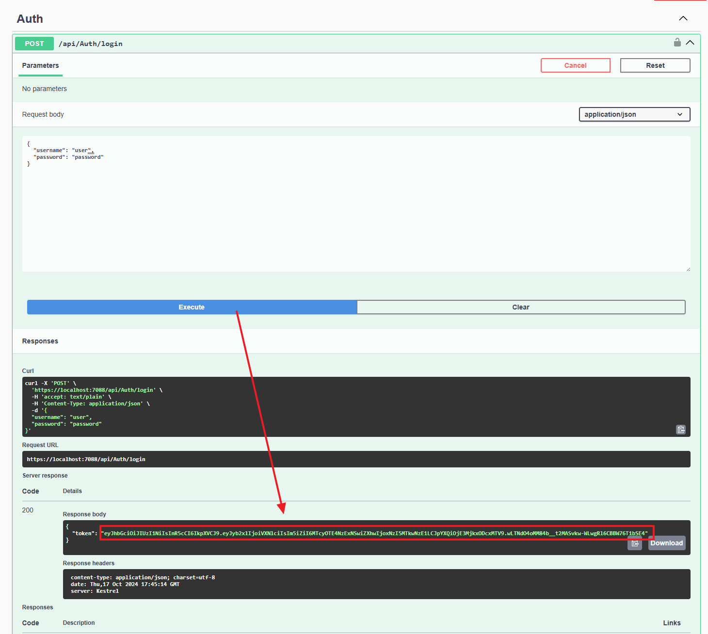

# 專案說明
  以 **Swagger** 建立 Restful CURD 功能的 web-api 測試介面   
 
 - 介面

- 未登入而查詢，得到 401 (未授權)錯誤。

- 執行登入(一般權限，可以新增、修改，不能刪除)

- 執行成功後，獲取 JWT Token

- 到認證畫面，輸入Token

- 認證後，可以看到個頁面均已解鎖。不然執行後，都會得到 401 (未授權)錯誤。

- 驗證GET功能，OK。

- 驗證POST功能，OK。

- 驗證GET{id} 功能(讀取指定ID客戶資料)，OK。

- 驗證PUT{id} 功能(修改指定ID客戶資料)，OK。
 

- 再次重新讀取所有客戶資料

- 執行DELETE (刪除指定ID客戶資料)，會得到 401 (未授權)錯誤，因為權限不足。

- 改用admin登入 (登入成功後，Token 要用新值重新認證)

- 再次執行DELETE ，OK。

## 各API header/body/param/response 內容
  header 及 body 請參考畫面，param 及 response 分述下:
 
- GET (查詢所有客戶資料)
  - 傳送參數
    - param 無
  
  - 返回值
    - response code="200"，顯示所有客戶.
    - response code="401"，沒有權限可開啟本頁.
    - response code="404"，尚無資料.
    
- Get("{id}")(查詢單筆客戶資料)
  - 傳送參數
    - param name="id"，要查詢的客戶ID:，

  - 返回值
    - response code="200"，查詢到客戶資料.
    - response code="401"，沒有權限可開啟本頁.
    - response code="404"，查無資料.
    

- POST (建立的客戶資料)
  - 傳送參數
    - param name="customer"，要建立的客戶資料內容.
  
  - 返回值
    - response code="201"，新客戶添加成功.
    - response code="400"，無效的輸入值.
    - response code="401"，沒有權限可開啟本頁.
   

- PUT
  - 傳送參數
    - param name="id"，要更改的客戶 ID:，
    - aram name="customer"，要更改的客戶資料:，
  
  - 返回值 
    - response code="204"，客戶資料更改成功.
    - response code="400"，無效的輸入值.
    - response code="401"，沒有權限可開啟本頁.
    - response code="404"，無此ID資料.

- DELETE
  - 傳送參數
    - param name="id"，要刪除的客戶 ID:

  - 返回值
    - response code="204"，客戶資料刪除成功.
    - response code="401"，沒有權限可開啟本頁.
    - response code="404"，尚無資料.
   

 
